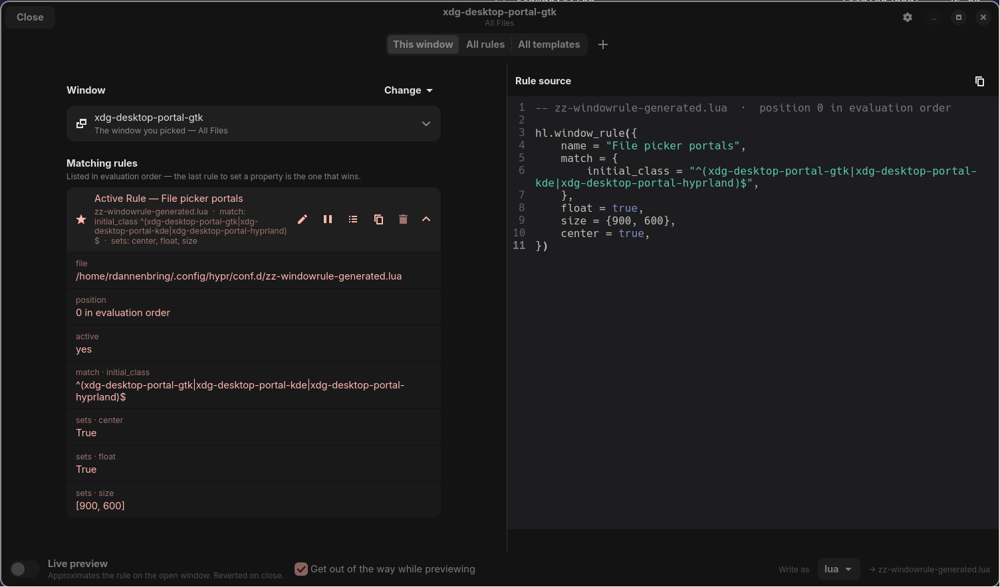
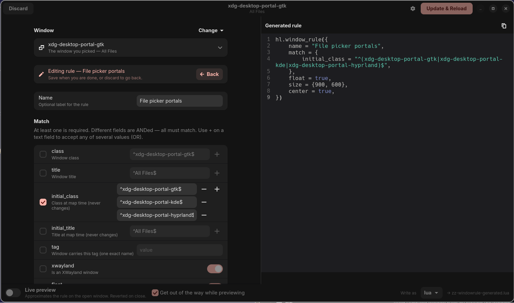
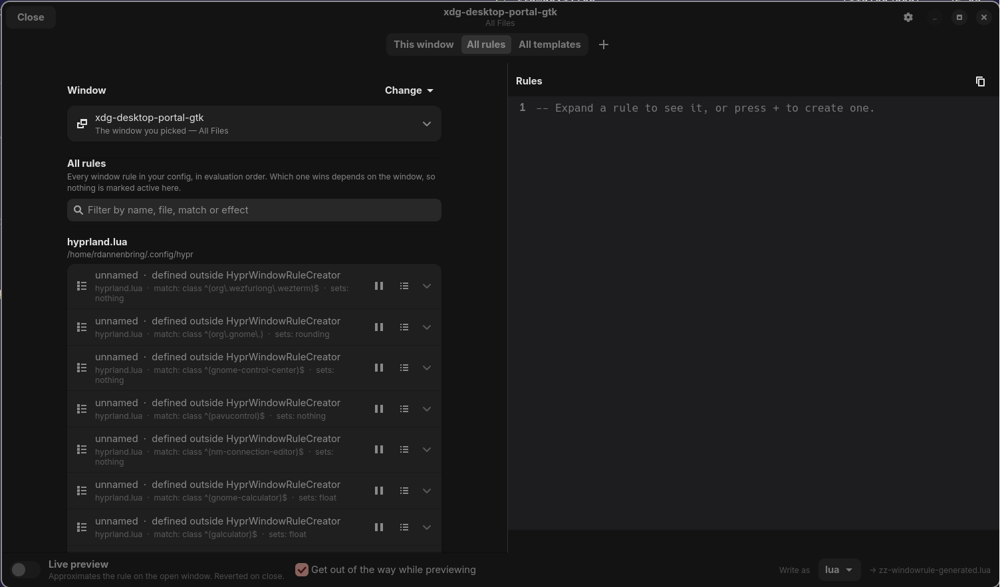
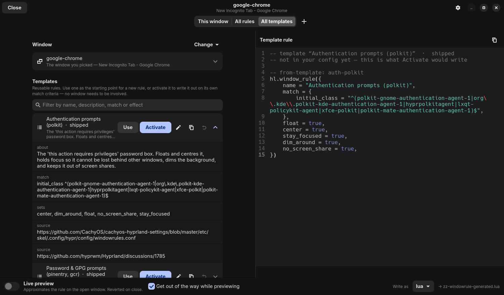

# hyprwrc — HyprWindowRuleCreator

Build a Hyprland window rule by clicking the window you want it to apply to.

Press a keybind, click a window, and get a form pre-filled with that window's
properties, a live-updating preview of the generated rule, and a save that
writes correct syntax into your config and reloads.

Targets Hyprland **0.55+** (the `hl.window_rule()` Lua syntax). Emits the
legacy `windowrule { ... }` block form too, for configs still on hyprlang.

---

## Why

Writing a window rule means running `hyprctl clients`, finding your window in a
wall of JSON, hand-escaping a regex, remembering which of ~58 effects you
wanted and how its value is spelled, editing a config file, reloading, and
discovering you got the regex wrong. This collapses that into: click the
window, tick some boxes.

Nothing else does this. [`hyprprop`](https://github.com/hyprwm/contrib/tree/main/hyprprop)
inspects a clicked window but stops there — it prints JSON and writes nothing.
The general-purpose Hyprland config GUIs
([hyprgui](https://github.com/MarkusVolk/hyprgui),
[hyprconfig](https://github.com/spinualexandru/hyprconfig)) don't cover window
rules at all.

## What it looks like

Rules that already apply to the window you picked, in evaluation order. The one
that actually wins is pinned to the top; expanding any row puts its real source
from the file in the pane.



Editing one. The list gets out of the way, the form takes its place, and the
generated rule updates as you type — here `initial_class` is matching any of
three portal implementations, joined into one RE2 alternation.



Every rule in the config, grouped by the file that defines them, files in load
order. Rules this tool did not write are listed too — they are a common reason
a new rule appears to do nothing.



The template library. Expanding one shows what activating it would write,
along with where the recipe came from.



## Install

### Arch (AUR)

```bash
yay -S hyprwrc-git
```

Published as
[`hyprwrc-git`](https://aur.archlinux.org/packages/hyprwrc-git), a VCS package
tracking `main`. The `PKGBUILD` and `.SRCINFO` also live in
[`packaging/`](packaging/) if you would rather build from the checkout; see
[packaging/README.md](packaging/README.md) for the maintainer notes.

### From a checkout

Requires `python-gobject`, `gtk4`, `libadwaita`, `slurp`. Optional:
`gtksourceview5` for syntax highlighting in the generated-rule pane.

```bash
git clone https://github.com/rdannenbring/HyprWindowRuleCreator
cd HyprWindowRuleCreator && ./bin/hyprwrc
```

`bin/hyprwrc` runs straight from the checkout with no install step. The AUR
package installs the same thing as `hyprwrc` on your PATH.

## Licence

MIT — see [LICENSE](LICENSE).

## Keybinds

Two ways in, because they suit different moments:

```lua
-- Rule for whatever is under the pointer. No selection step.
hl.bind("SUPER + CTRL + mouse:273", hl.dsp.exec_cmd("/path/to/bin/hyprwrc gui --at-cursor"))

-- Click to choose instead, when the pointer is not already on the target.
hl.bind("SUPER + CTRL + W", hl.dsp.exec_cmd("/path/to/bin/hyprwrc gui"))
```

`SUPER + mouse:273` alone is the stock interactive-resize bind, so the `CTRL`
matters.

The editor should float. It ships no rule for itself — add one:

```lua
hl.window_rule({
  match  = { class = "^dev\\.hyprwrc\\.HyprWindowRuleCreator$" },
  float  = true,
  center = true,
  size   = {1500, 880},
})
```

## Use

```bash
hyprwrc                      # click a window, open the editor
hyprwrc gui --at-cursor      # target the window under the pointer
hyprwrc cursor               # print the window under the pointer
hyprwrc pick                 # click a window, print its properties
hyprwrc pick --json          # ... as JSON
hyprwrc list                 # list selectable windows
hyprwrc rules --at-cursor    # rules that already apply to a window
hyprwrc templates            # list rule templates and their sources
hyprwrc catalog              # every known prop and effect
hyprwrc where                # where rules get written
hyprwrc gui --address 0x...  # skip selection entirely
```

## How it works

**Picking.** `slurp -r` is fed one box per window and returns the label of the
box you clicked. Borrowed from `hyprprop`, which took it from `grimblast`.
Restricting to predefined boxes means overlapping windows are disambiguated by
you looking at them, not by the tool guessing z-order.

`--at-cursor` skips that. Hyprland has no window-at-point call, so it
hit-tests `cursorpos` against client geometry and breaks overlaps by asking the
compositor: under `follow_mouse` the active window *is* the hovered one, which
beats any guess. Failing that it prefers an open special workspace (those
render on top), then `focusHistoryID`.

The target is resolved *before* the GUI exists. That ordering is load-bearing
for both modes and doubly so for `--at-cursor`: the moment the editor maps it
becomes the active window, so a lazily-resolved target would resolve to
itself.

**Changing target.** "Change" in the Window header retargets the editor without
relaunching: pick from a filterable list of open windows, or click one. The
editor excludes itself either way — pointing it at itself would preview effects
on the window you are reading. Switching reverts any preview on the window being
left behind, so nothing is stranded, and rescans rules for the new one.

Clicking to pick parks the editor on a special workspace for the duration,
since otherwise it covers the very windows you are trying to click, and runs
slurp on a **worker thread**.

The thread is not optional. slurp waits on a human, and blocking the GTK main
loop for the seconds that takes is exactly what makes the compositor decide the
app has hung and offer to kill it. Measured: with slurp on the main loop the
loop ticked 0 times in 8 seconds; on a thread, 15.

Hiding has to be compositor-side for the same reason, and two obvious ways do
not work — `set_prop opacity 0` leaves the *focused* window fully visible
(it maps to the inactive value), and `alter_zorder bottom` does nothing when
the editor is alone on its workspace. Moving it away genuinely removes it. The
move back is unconditional and retries, because an editor left on a special
workspace looks exactly like the app having crashed.

**Scope: this window, all rules, or templates.** Tabs at the top of the window,
above everything else, switch the list between rules that match the picked window, *every*
rule in your config, and the template library. It is a filter on one list rather than a second screen —
editing, deactivate, duplicate, delete and save-as-template all
behave identically either way, so there is no second implementation to drift.

Two things change in the All scope, both because they are claims that only
make sense about a specific window:

- **Nothing is marked active.** Which rule wins depends on the window; with the
  list spanning rules for many different apps, an "Active Rule" badge would be
  a statement about nothing in particular.
- **Live preview is refused** when the rule being edited does not match the
  window in the editor, with the reason in the tooltip. Editing a Thunar rule
  while the editor points at a terminal and applying its effects to that
  terminal would misrepresent what the rule does.

Rules that *do* apply to the current window are badged "matches this window",
so the two views stay connected. A filter box searches name, file, match and
effects — useful once a config has a few dozen.

The All scope groups rules under the file that defines them, files in load
order, so the sections themselves read as the evaluation order. Expanding any
row puts that rule's **actual source** in the right-hand pane — the exact text
from the file, not a re-rendering of what was parsed out of it — with its
position and whether it is commented out.

Expanding a template does the same, except a template has no file to quote, so
the pane shows what activating it *would* write — rendered through the same
emitter that would write it — and says whether it is already in your config,
already there but deactivated, or not yet added.

**Existing rules.** On open, the config is scanned for rules that already apply
to the picked window, and they are listed **in evaluation order** — file load
order, then position within the file — because that is what decides which one
wins. The rule currently loaded sorts to the top and is highlighted. Each row
shows where it came from, what it matches on, and only the effects actually
set; expand it for the full detail.

Exactly one of our rules opens automatically. Several are listed to choose
from, since guessing wrong means silently editing the wrong rule.

The **Active Rule** — the last enabled rule to be evaluated, i.e. the one that
actually wins — is pinned to the top and highlighted. Everything else that
matches is dimmed. "Active" means what the window is doing now, not what is
loaded in the editor: calling a draft active would misreport reality.

**Browse or edit, never both.** The window has two states. Browsing shows the
rules list and its scope toggle; editing hides them and puts the form in their
place, behind an "Editing ‹name›" header with a Back button. The header button
becomes Discard, and Save appears only while editing.

A separate editor window was the obvious alternative and was rejected: the form
is 17 match fields plus 58 effects, so the dialog would be near-fullscreen
anyway, and live preview parks and resizes *this* window — an `Adw.Dialog` is a
child of it, so the choreography would have needed rebuilding for no gain in
focus.

**Nothing is written before you save.** Rule drafts never touched disk; template
creation used to, which is how empty "New template" entries appeared just from
pressing `+` and wandering off. Templates now behave like rule drafts — an
unsaved one gets a `· Not saved` row and reaches `templates.json` only on Save.

**Leaving with unsaved work asks first** — on Discard, on closing the window,
and on changing target window. Only when something was actually typed: the
baseline is snapshotted on entry, so a fresh draft holding just the matcher
seeded from the window leaves silently. Loading an existing rule or template is
not an edit either; changing one afterwards is.

**Drafts.** A draft is created only when you ask for one — the `+` in the
section header, or the button in the empty state. Opening the editor never
creates one on its own, whatever the window already has.

A draft gets its own row titled `‹name› · Not saved`, tracking the form as you
fill it in, so what you are typing appears where rules live rather than only in
the code pane. Saving turns it into a real row. The window stays open after
saving, since "Not saved" is not much of a promise if the window vanishes
before you see it resolve.

When nothing matches, the list says so and offers to start one:

> **No matching rules found for this window**
> Nothing in your config applies to it yet.
>
> **[Use an existing rule]  [Create from template]  [Create new rule]**

Per-rule actions:

| action | ours | not ours |
| --- | --- | --- |
| Edit — load into the form | yes | no |
| Deactivate / reactivate — comment out in place | yes | yes, with confirmation |
| Save as template | yes | yes |
| Duplicate | yes | no |
| Delete | yes | **never** |

There was a "Make Active" that moved a rule last *and* commented out every
other rule matching the same window. It was removed: it edited several files at
once, including ones this tool did not write, behind a single confirmation and
with no way to see the result first — more destructive than helpful. Per-rule
deactivate reaches the same end transparently and reversibly.

Editing replaces the fenced block where it sits, because re-appending it would
silently change which rule wins.

Rules from elsewhere in your config are listed too. They are worth seeing: a
rule you did not write is a common reason a new one appears to do nothing.
They can be commented out — always behind a confirmation naming the file, and
always after a timestamped backup — but never deleted. Commenting is
reversible and obvious in a diff, so a wrong guess stays recoverable.

Reading a rule back runs it through Hyprland's own Lua VM rather than a
hand-rolled parser, so variables and concatenation work. Two safeguards, since
this happens just from opening a window:

- only `hl.window_rule(...)` call sites are lifted out and evaluated, never the
  surrounding file — config files `require`, spawn startup apps and shell out,
  and none of that should run because you right-clicked something;
- the sandbox environment has no `io`, `os`, or `require` at all.

Files are filtered by dialect too. A config whose entrypoint is `hyprland.lua`
cannot source hyprlang `.conf` files, so rules still sitting in them are inert
and reporting them would be misleading — half-migrated setups are full of them.

**Matching.** Literal values are RE2-escaped and anchored —
`com.mitchellh.ghostty` becomes `^com\.mitchellh\.ghostty$`. Unescaped, those
dots are wildcards and the rule matches more than you picked. Hyprland uses
[RE2](https://github.com/google/re2/wiki/Syntax), so negation is a `negative:`
prefix, not a lookahead.

**Several values for one field.** `class`, `title`, `initial_class`,
`initial_title` and `xdg_tag` have a `+` that adds another alternative. They
are joined into one RE2 alternation on the way out — `^(Alacritty|foot)$` —
because Hyprland rejects a repeated field inside `match` ("there is only one of
one type"). Loading a rule back splits the alternation into rows again;
anything it cannot take apart cleanly comes back as a single value, so a
hand-written regex is never mangled.

That gives **OR within a field**. **AND across fields** is already what `match`
does — every prop must match. AND *within* one field is not expressible at all:
RE2 has no lookahead, so no pattern can demand that one string match two
things at once.

`tag` deliberately has no `+`. Tag matching is literal name comparison, not
RE2 — verified on 0.56, a window tagged `xx` matches `tag = "xx"` but not
`tag = "(xx|yy)"`. Offering OR there would hand you an alternation that
silently never fires.

`initial_class` is preferred over `class`, and `title` is left off by default:
static effects are evaluated against the values a window had *at map time*, so
matching the live title of a browser tab does not do what it looks like.

**Reusing a rule you already have.** Most of the time the rule you want already
exists for a different window. The copy button next to the `+`, and the "Use an
existing rule" button in the empty state, open a searchable list of every rule
in the config with two things you can do to each:

- **Clone** — a new draft that does what that rule does, aimed at the window in
  the editor. Effects come across; the class/title matchers are replaced with
  this window's, since a copy that kept them would fight the original. State
  matchers like `xwayland` or `float` are kept — they are conditions the author
  meant, and dropping them would silently widen the rule. Nothing is written
  until you save.
- **Add this window** — leaves the rule where it is and widens it, turning
  `^kitty$` into `^(kitty|Alacritty)$`. This is the multi-value `+` above,
  applied to a rule already on disk.

Adding edits the rule in place, including in files this tool did not write, so
it is deliberately narrow: **only the quoted value of one match field is
replaced**. Formatting, comments, field order and any key the form has no field
for are left byte-for-byte alone, and the dialog shows the exact before/after
first. When the value cannot be located unambiguously — a rule built from a
variable, a `["class"]` subscript — the edit is refused rather than guessed at,
and cloning is offered instead. The usual guarantees still apply on top: the
whole file is compile-checked before anything touches disk, backed up, and
restored if Hyprland rejects the result.

If the rule matches on more than one identity field it asks which to widen,
because picking for you would change what the rule means. If the value being
added has already drifted since the window opened — a shell prompt in a title,
an Electron app rewriting its class — the confirmation says so, since a rule
pinned to a value like that quietly stops matching.

**Preview.** A window rule only fires when a window maps, so previewing means
reproducing the effects through a second mechanism:

| rule kind | preview via |
| --- | --- |
| dynamic effects (40) | `hl.dsp.window.set_prop` — the wiki: *"All dynamic effects can be set with set_prop"* |
| static effects with a dispatcher (10) | `float`, `resize`, `move`, `center`, `pin`, `pseudo`, `fullscreen` |
| everything else (8) | not previewable — reported, never silently dropped |

50 of 58 effects can be previewed. Expression-valued `move`/`size`
(`monitor_w*0.5`) can't: dispatchers take literal pixels. Preview keeps a
journal and reverts on close.

Two effects are held back on purpose. `stay_focused` would pin focus to the
target so you could never return to the editor, and `confine_pointer` would
trap the mouse inside it. Both still save and apply normally — they are only
excluded from *preview*, with the reason shown.

While previewing, the editor shrinks to a pinned strip in the bottom-right
corner so you can actually see the window you are styling. Click the expand
icon to come back. Turn it off with the checkbox in the footer.

**The generated pane** updates from the first keystroke, including while a rule
is still incomplete — a half-built rule renders, with what is missing as a
comment on the first line rather than something that replaces the whole pane.
Save stays disabled until the rule is actually valid.

**Editing the output.** The generated pane is editable. Hand-edit it and the
form stops driving it (with a "Revert to form" escape hatch); saving writes
your text verbatim, still compile-checked first. This matters because the
catalog will always trail Hyprland by some margin, and text is the way out
when it does.

**Saving.** Rules go to `conf.d/zz-windowrule-generated.{lua,conf}`, fenced by
markers so they can be edited or removed later. Hand-edited config is never
touched. If your `hyprland.lua` globs `conf.d/*.lua` it loads with no further
setup.

The `zz-` prefix is load-bearing. A glob sorts alphabetically, so a file named
`windowrule-generated.lua` still loses to `windowrule-modal.lua` and
`windowrule-special.lua` — which would make "set as active" a lie. `zz-` puts
it last, so the bottom of that file really is the last word. An existing
`windowrule-generated.*` is renamed once, automatically.

The dialect is detected from your config — a `hyprland.lua` entrypoint means
lua even when legacy `.conf` files are still lying around, which is what a
half-finished migration looks like. The footer dropdown shows what was
detected and lets you override it; switching also changes which file is
written.

Every save is validated **before** anything touches disk, by compiling the
prospective file in Hyprland's own Lua VM via `load()` (side-effect free).

## Two things that bite

**`configerrors` cannot be trusted for Lua.** A `.lua` file pulled in by a
`loadfile()`-style glob reports syntax errors on *stderr*. `hyprctl
configerrors` stays empty, so a broken file looks like a clean save. This was
found the hard way — post-write verification alone silently accepted garbage.
Hence the pre-flight compile.

**Hyprland does not validate effect names.** `hl.window_rule({ match = {...},
no_such_effect = true })` is accepted without complaint; the effect is simply
ignored. The catalog in `catalog.py` is the only thing catching a typo'd
effect, which is why it is transcribed from the wiki rather than guessed, and
why it is version-gated (`SCHEMA_FOR`).

## Templates

Reusable rules for the things everyone ends up writing anyway. They are the
third scope of the main list — **All templates** — with the same search box,
rather than a separate window. The `+` follows the scope: a new rule in the
rule scopes, a new template in the template one.

Four distinct actions, because they are genuinely different:

| | |
| --- | --- |
| **Use** | Load it into the editor as an unsaved draft, to adjust before saving. If the template brings no match criteria of its own, the picked window's matcher is kept — otherwise "Use" on a starting-point template would produce a rule matching nothing. |
| **Activate** | Write it straight out as a rule on its own match criteria. No window needs to be involved — this is how you switch on "float all polkit prompts" without hunting down a polkit prompt to click. |
| **Edit** | Change its match and effects in the same form as any rule. Saving updates the template; your config is untouched. |
| **Save as template** | On any rule row — turn something you already built into a reusable one. |

Activating records where the rule came from — a `-- from-template: <id>`
comment above the block. That is what lets the template row show **Deactivate**
once it has a rule, and **Reactivate** if that rule is switched off, instead of
offering Activate again and quietly adding a second copy. Rules created this way
are badged "from template ‹name›" in the All rules list, with their own icon.

A comment rather than anything structural: it survives hand-editing, the Lua
parser ignores it, and blocks written before it existed simply have none.
Matching a rule to its template by name would break the moment either was
renamed.

Editing a shipped template never modifies the shipped data. It writes a user
copy under the same id that shadows it, so **Restore** is available forever and
a future update to the built-in set cannot silently overwrite your edits. User
templates live in `~/.config/hyprwrc/templates.json`.

### What ships

Eleven, drawn from the [Hyprland wiki](https://wiki.hypr.land/Configuring/Basics/Window-Rules/),
[CachyOS's curated defaults](https://github.com/CachyOS/cachyos-hyprland-settings/blob/master/etc/skel/.config/hypr/config/windowrules.conf),
and patterns that recur across widely-used dotfiles. Each carries its sources
so you can judge it rather than take it on faith:

- **Authentication prompts (polkit)** — float, centre, hold focus, dim, hide from screen share
- **Password & GPG prompts (pinentry, gcr)** — the wiki names `stay_focused` here specifically to fix pinentry losing focus
- **File picker portals** — xdg-desktop-portal gtk/kde/hyprland
- **Common dialog titles** — Open/Save/Choose, for apps that draw their own
- **Modal dialogs (any app)** — matches the `modal` flag, so it covers apps you haven't thought about
- **Picture-in-Picture** — float, pin, sized
- **Settings & utility apps** — audio, bluetooth, network, archives, disks
- **Password managers** — `no_screen_share` only, so a vault can't end up in a recording
- **XWayland video bridge** — the screen-sharing helper made invisible
- **Steam sub-windows** — friends list and settings
- **Just float and centre** — a starting point with no match criteria

Class names are the awkward part: the same dialog is called different things
depending on toolkit and portal implementation, which is why several match an
alternation. Check yours with `hyprwrc cursor` before assuming a template fits.

`hyprwrc templates` lists them all with their sources.

## Settings

Gear icon in the header. Stored at `~/.config/hyprwrc/settings.json`, kept out
of the Hyprland config on purpose — that file is machine-managed, and settings
should survive deleting every rule.

| setting | default | notes |
| --- | --- | --- |
| Generated rules file | `conf.d/zz-windowrule-generated.lua` | Relative to your hypr config dir. Absolute and `..` paths are refused — they would write where Hyprland never reads. The screen warns if the name no longer sorts last, since rules saved there would then be overridden by other conf.d files. |
| Syntax | `auto` | Detected from your config; force `lua` or `conf`. |
| Backups to keep | 10 | Oldest pruned beyond this. 0 keeps everything. |
| Open the matching rule automatically | on | Only when exactly one of ours matches. |
| Get out of the way while previewing | on | The corner strip. |
| Confirm edits to other people's config | on | Turning this off is not recommended. |

## Renaming before release

Names live in `branding.py`, split by whether changing them is safe:

| constant | safe to change | why |
| --- | --- | --- |
| `APP_NAME` | **yes** | Display text only — dialogs, badges, generated-file header. |
| `CLI_NAME` | **yes** | Shown in `--help`. |
| `APP_ID` | mostly | Harmless for data, but any window rule targeting the editor itself matches on it. |
| `FENCE_TAG` | **no** | Written around every generated rule as `>>> hyprwrc <id>`. Rules already in someone's config carry the old tag; change it and the app stops recognising its own rules — they show as defined elsewhere, lose their edit/delete actions, and a second copy gets appended instead of the existing one updated. |
| `CONFIG_DIR_NAME` | **no** | `~/.config/hyprwrc/` holds settings and user templates. Changing it hides them rather than moving them. |

Renaming the two unsafe ones needs migration code that also reads the old
value. `tests/test_branding.py` asserts the split holds — including that no UI
string hardcodes the display name.

## Layout

```
hyprwrc/
  ipc.py       Hyprland control socket (raw, not hyprctl — preview is chatty)
  picker.py    slurp-based window selection
  catalog.py   17 props + 58 effects, transcribed from the wiki
  model.py     rule model, RE2 escaping, matcher suggestion
  scan.py      find rules that already apply to a window
  templates.py / builtin_templates.py / templates_ui.py   reusable rules
  gtkutil.py   row + toast factories with Pango markup disabled
  emit.py      lua and conf emitters
  preview.py   set_prop / dispatcher preview with a revert journal
  store.py     fenced writes, pre-flight validation, backup + rollback
  settings.py  user preferences
  settings_ui.py  the settings dialog
  ui.py        GTK4 / libadwaita editor
  cli.py       headless entry points
```

## Note on the IPC socket

A bare `-` anywhere in a control-socket payload comes back as `unknown
request`. Since Lua source is full of them (every comment starts with `--`),
`ipc.compile_lua` encodes the chunk as pure `\ddd` escapes so the payload is
nothing but digits, backslashes and quotes.

## Status

Working end to end: pick → build → emit → validate → write → reload, with the
rule verified to apply to newly-opened windows, and removal verified to stop
applying. Hand-edited text verified to save verbatim and apply. Developed and
tested against Hyprland 0.56.0.

Known cosmetic nit: the compact strip asks to be 96px tall and gets ~200, so it
has empty space in it. It is still cornered and out of the way.

Not done yet: editing (rather than just deactivating) rules this tool did not
write, arbitrary drag reordering, `layer_rule` support, grouping the All-rules
list by file.

## Testing

`tests/` covers the parts that need no compositor — RE2 escaping, both
emitters, rule validation, and the at-cursor hit-test and its tiebreaks:

```bash
python3 tests/test_emit.py && python3 tests/test_picker.py
```

Anything needing a live compositor was exercised against a nested Hyprland on
a headless output rather than the developer's own session. `hyprctl output
create headless` matters there: a nested instance parked out of sight stops
presenting frames, and `grim` then blocks forever.
